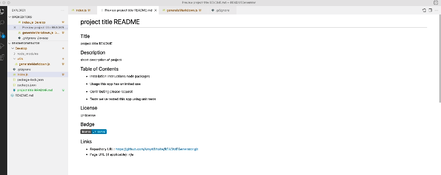

# READMEGenerator
# 09 Node.js Homework: Professional README Generator

## Scope
This is a professional README Generator that assists to dynamically create a readme file for developers who are creating projects.
This allows for a README file to be created using command line application and can be invoked by using node index.js.

* This README Generator uses the Inquirer package to generate a README.md file with the following:
* Title
* Description of work product
* Table of Contents (Installation, Usage, Contributions, Test)
* License
* Badge
* Github User Name
* Links to repository
* Email address (for additional questions)
* Links to work product

## Preview

* Preview Content: https://drive.google.com/file/d/17ZctIwB-Yz0z4sEs2GTYf4aS_tfEPkae/view

## Link
* Repository: https://github.com/AmyWilhoite/READMEGenerator.git

